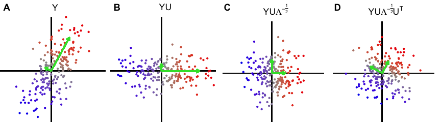

<!-- README.md is generated from README.Rmd. Please edit that file -->

<!-- badges: start -->

<!-- badges: end -->

<br>

### Fast Probabilistic Whitening Transformation for Ultra-High Dimensional Data

<div style="text-align: justify">

Data whitening is a widely used preprocessing step to remove correlation
structure since statistical models often assume independence [(Kessy, et
al. 2018)](https://doi.org/10.1080/00031305.2016.1277159). The typical
procedures transforms the observed data by an inverse square root of the
sample correlation matrix (**Figure 1**). For low dimension data
(i.e. $n > p$), this transformation produces transformed data with an
identity sample covariance matrix. This procedure assumes either that
the true covariance matrix is know, or is well estimated by the sample
covariance matrix. Yet the use of the sample covariance matrix for this
transformation can be problematic since **1)** the complexity is
$\mathcal{O}(p^3)$ and **2)** it is not applicable to the high
dimensional (i.e. $n \ll p$) case since the sample covariance matrix is
no longer full rank.

Here we use a probabilistic model of the observed data to apply a
whitening transformation. Our Gaussian Inverse Wishart Empirical Bayes
(GIW-EB) **1)** model substantially reduces computational complexity,
and **2)** regularizes the eigen-values of the sample covariance matrix
to improve out-of-sample performance.

</div>

<figure>

<figcaption aria-hidden="true"><strong>Figure 1: Intuition for data
whitening transformation</strong>. <strong>A)</strong> Original data,
<strong>B)</strong> Data rotated along principal components,
<strong>C)</strong> Data rotated and scaled, <strong>D)</strong> Data
rotated, scaled and rotated back to original axes. Green arrows indicate
principal axes and lengths indicate eigen-values.</figcaption>
</figure>

## Installation

``` r
devtools::install_github("GabrielHoffman/decorrelate")
```
